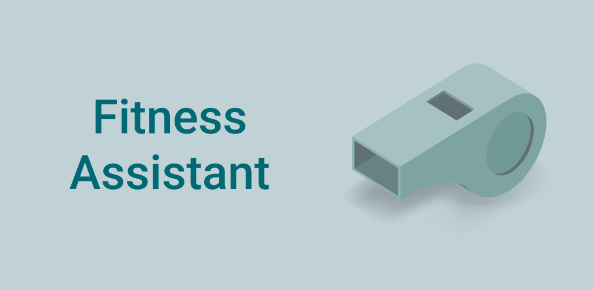
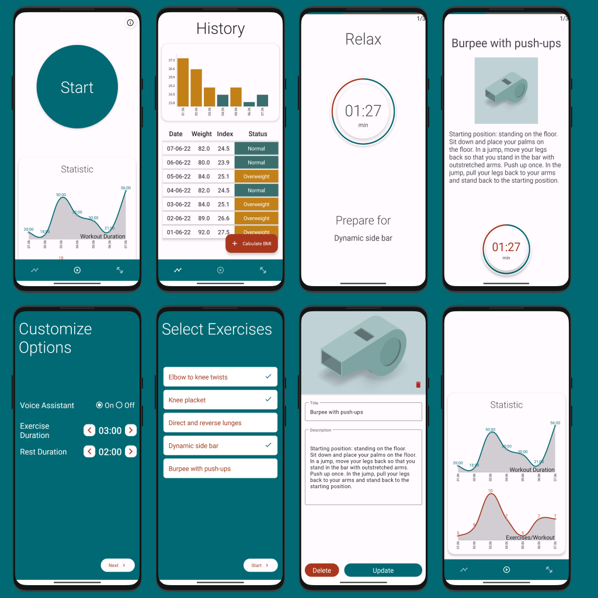
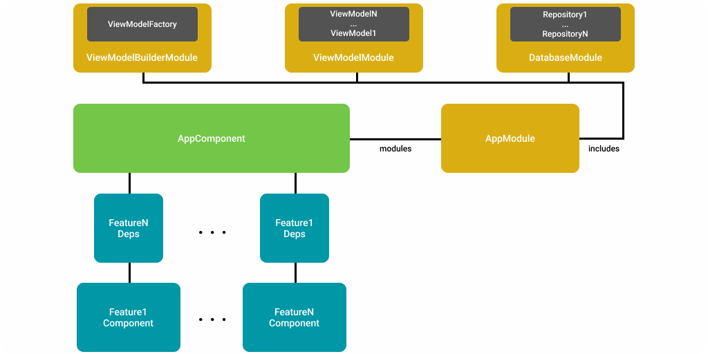
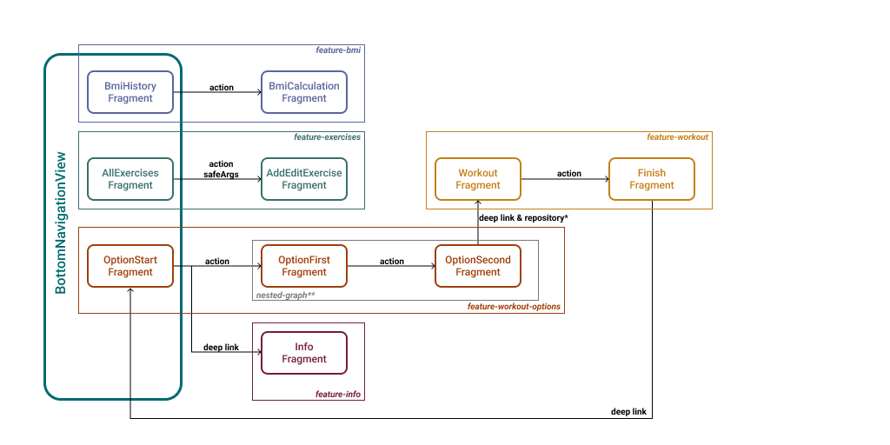

# Fitness Assistant

 

_ _ _ 

## Introductions

Fitness Assistant provides the user platform whereby he can train using his exercises and track the result. The Project is based on **a multi-module architecture** using modern android development technologies.
  

## Previews

_ _ _ 
  

## Technology Overview
### Modules Structure

- **core** - Elements and Technological Solutions used by project modules everywhere
- **core-data** - Database and Data Class Models
- **core-theme** - App Theme and XML styles
- **feature-N** - Functional part of Application
_ _ _

### Dagger Dependency Graph

_ _ _

### Navigation Graph

- ___repository*___ - For data transferring between **OptionSecondFragment** and **WorkoutFragment** are used StatisticEntity and RepositoryStatistic respectively. **OptionSecondFragment** saves all customized options by the user and selected exercises. **WorkoutFragment** requests the Latest Row from Statistic Table and then sets up the workout.

- ___nested-grapgh**___ - **OptionFirstFragment** and **OptionSecondFragment** are used shared viewModel **(OptionsViewModel)**. For this reason, the graph is used for viewModel's lifecycle control.
_ _ _
 

## Technology Stack
- **Kotlin**
- **Jetpack**
	- Lifecycle
	- LiveData
	- ViewModel
	- Room
	- Navigation Component & safeArgs
- **Dagger2**
	- Multibinding
	- Scopes
- **Firebase**
	- Performance Monitoring
	- Crashlytics 
	- Analytics
- **Admob**
- **Glide**
_ _ _
 
